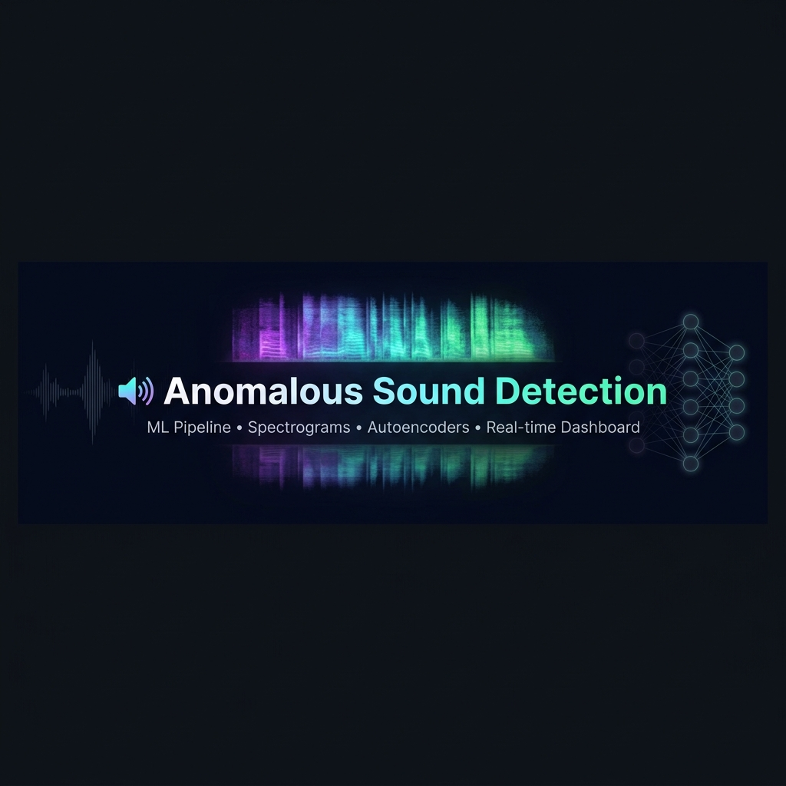

<div align="center">



<br/>

# 🔊 Anomalous Sound Detection using Spectrograms

**A production-ready pseudo-MLOps pipeline for detecting anomalous industrial machine sounds using mel spectrograms, deep autoencoders, and a live web dashboard.**

<br/>

[](https://python.org)
[](https://tensorflow.org)
[](https://pytorch.org)
[](https://fastapi.tiangolo.com)
[](https://mlflow.org)
[](LICENSE)

<br/>

[🚀 Quick Start](#-quick-start) · [📖 Pipeline Guide](#️-running-the-pipeline) · [🌐 Dashboard & API](#-web-dashboard--api) · [🧠 Models](#-models) · [🔧 Config](#-configuration)

</div>

---

## 🎯 What is this?

This project implements an **end-to-end anomaly detection system** for industrial machine audio — inspired by the [DCASE 2022 Task 2](https://dcase.community/) challenge. It detects whether a machine (e.g., a gearbox) sounds **normal** or **anomalous**, using the principle:

> *A model trained only on normal sounds will have **high reconstruction error** when it encounters sounds it has never seen — i.e., anomalies.*

The full system includes:
- 🎵 A **7-stage ML pipeline** (preprocess → train → evaluate → predict → fuse)
- 🌐 A **live web dashboard** with real-time inference via REST API
- 📊 **MLflow** experiment tracking and **versioned model artifacts**
- ☁️ **Google Colab** ready for GPU training

---

## ✨ Features at a Glance

| 🔧 Component | 📌 What it does |
|---|---|
| 🎵 **Audio Preprocessing** | Converts `.wav` → mel spectrograms → `.npy` arrays |
| 🧠 **Autoencoder (Keras)** | Reconstruction-error anomaly detection on spectrograms |
| 🤖 **STGram-MFN (PyTorch)** | Graph-based model for domain-shifted target data |
| 🔀 **Score Fusion** | Ensemble anomaly scores from both models |
| 📊 **AUC / ROC Evaluation** | Full metrics with distribution plots and ROC curves |
| 🌐 **Web Dashboard** | Dark-themed HTML/CSS/JS frontend with live KPI cards |
| 📡 **FastAPI Backend** | Upload `.wav` → get score + severity label in real-time |
| 🧪 **MLflow Tracking** | Experiment logs, hyperparameters, and model artifacts |
| 🔢 **Auto-versioning** | Models saved as `v1/`, `v2/`, … with auto-increment |
| ☁️ **Colab Ready** | Full training on Colab GPU; local dry-run mode for dev |

---

## 🗂️ Project Structure

```
Anamalous-sound_detection/
│
├── 📂 pipeline/                    # Numbered, sequential pipeline stages
│   ├── 01_preprocess.py            # Audio → mel spectrogram (.npy)
│   ├── 02_train.py                 # Train Keras autoencoder
│   ├── 03_evaluate.py              # AUC, ROC, score distributions
│   ├── 04_predict.py               # Score a single WAV file
│   ├── 05_train_stgram.py          # Train STGram-MFN (PyTorch)
│   ├── 06_evaluate_stgram.py       # Evaluate STGram-MFN
│   └── 07_fuse_anomaly_scores.py   # Fuse scores from both models
│
├── 📂 src/                         # Core library (pip installable)
│   ├── data/                       # AudioLoader, SpectrogramExtractor
│   ├── models/
│   │   ├── autoencoder.py          # Keras autoencoder architecture
│   │   ├── stgram_mfn.py           # STGram-MFN PyTorch model
│   │   └── base_model.py           # Shared base class
│   ├── training/                   # Trainer, callbacks, MLflow hooks
│   ├── inference/                  # AnomalyScorer, ThresholdFitter, Predictor
│   ├── api/
│   │   ├── app.py                  # FastAPI routes
│   │   └── service.py              # DashboardService (predictions, KPIs)
│   └── utils/                      # Logger, seed, config helpers
│
├── 📂 web/                         # Frontend dashboard
│   ├── index.html
│   ├── app.js
│   └── styles.css
│
├── 📂 config/
│   ├── default.yaml                # Base config (audio, model, training, MLflow)
│   ├── experiment_01.yaml          # Override example
│   ├── stgram_mfn.yaml             # STGram-MFN config
│   └── mlflow.yaml                 # MLflow server config
│
├── 📂 Data/                        # Raw + processed data (gitignored)
│   └── gearbox/
│       ├── train/                  # Normal sounds only
│       ├── source_test/            # Normal + anomaly
│       └── target_test/            # Normal + anomaly (domain shift)
│
├── 📂 artifacts/                   # All outputs (gitignored)
│   ├── models/v1/, v2/, …          # Versioned .keras checkpoints
│   ├── evaluation/                 # metrics.json, ROC curves, plots
│   ├── predictions/                # Per-inference JSON results
│   └── logs/                       # Training and pipeline logs
│
├── run_pipeline.py                 # Top-level orchestrator
├── setup.py                        # Makes src/ importable
├── requirements.txt
├── environment.yml
└── Makefile
```

---

## 🚀 Quick Start

### 1️⃣ Clone & Setup Environment

```bash
git clone https://github.com/SARWAGYASHAH/Anomalous-Sound-Detection-using-Spectrograms.git
cd Anomalous-Sound-Detection-using-Spectrograms
```

```bash
# Recommended: conda
conda env create -f environment.yml
conda activate anomalous-sound

# Or: pip
python -m venv .venv
.venv\Scripts\activate       # Windows
source .venv/bin/activate    # macOS/Linux
pip install -r requirements.txt
```

### 2️⃣ Install as Package

```bash
pip install -e .
```
> This makes `from src.models.autoencoder import ...` work from anywhere in the project.

### 3️⃣ Download the Dataset

Get the **DCASE 2022 Task 2 — Gearbox** dataset and place it as:

```
Data/
└── gearbox/
    ├── train/          ← normal sounds only
    ├── source_test/    ← normal + anomaly (source domain)
    └── target_test/    ← normal + anomaly (target domain)
```

---

## ⚙️ Running the Pipeline

### 🔢 Stage by Stage

```bash
# 1. Preprocess: WAV → mel spectrograms
python pipeline/01_preprocess.py
python pipeline/01_preprocess.py --save-png        # also save PNG previews

# 2. Train autoencoder (use Colab for GPU)
python pipeline/02_train.py --allow-training

# 3. Evaluate: AUC, ROC, score distribution
python pipeline/03_evaluate.py

# 4. Predict on a single audio file
python pipeline/04_predict.py --file path/to/machine.wav

# 5–6. STGram-MFN train + evaluate
python pipeline/05_train_stgram.py
python pipeline/06_evaluate_stgram.py

# 7. Fuse scores from both models
python pipeline/07_fuse_anomaly_scores.py
```

### 🎛️ Using the Orchestrator

```bash
# Preprocess + evaluate only
python run_pipeline.py --stages preprocess evaluate

# Local dry-run (validates pipeline, no real training)
python run_pipeline.py --train-dry-run

# Full pipeline (Colab)
python run_pipeline.py --allow-training --stages preprocess train evaluate

# Predict on one file
python run_pipeline.py --stages predict --predict-file path/to/audio.wav

# Use a custom experiment config
python run_pipeline.py --config config/experiment_01.yaml
```

### ⚡ Make Shortcuts

```bash
make preprocess
make train
make evaluate
make predict FILE=path/to/audio.wav
```

---

## 🌐 Web Dashboard & API

### Start the Backend

```bash
uvicorn src.api.app:app --host 0.0.0.0 --port 8000 --reload
```

### Open the Dashboard

Open `web/index.html` in your browser or serve it statically.

### REST API Reference

| Method | Endpoint | Description |
|:---:|---|---|
| `GET` | `/health` | Service status + model availability |
| `GET` | `/dashboard` | Full KPI summary (AUC, severity counts, trends) |
| `GET` | `/models` | List all versioned model artifacts |
| `GET` | `/evaluation/{split}` | Metrics for `source_test` or `target_test` |
| `POST` | `/predict` | Upload `.wav` → score + severity label |

### Example: Predict a File

```bash
curl -X POST http://localhost:8000/predict \
  -F "file=@gearbox_sample.wav"
```

<details>
<summary>📋 Example Response</summary>

```json
{
  "score": 0.072,
  "threshold": 0.045,
  "is_anomaly": true,
  "severity": "alert",
  "audio_file": "gearbox_sample.wav",
  "model_version": "v3",
  "created_at": "2026-06-02T23:00:00+05:30"
}
```
</details>

---

## 🧠 Models

### 🔷 Autoencoder (TensorFlow / Keras)

> Trained exclusively on **normal sounds**. High reconstruction error at inference = anomaly.

| Hyperparameter | Default |
|---|---|
| Input dim | 128 (n_mels) |
| Latent dim | 32 |
| Encoder layers | `[128, 64, 32]` |
| Decoder layers | `[32, 64, 128]` |
| Activation | ReLU + Dropout (0.2) |
| Loss | MSE |
| Optimizer | Adam (lr=0.001) |

### 🔶 STGram-MFN (PyTorch)

> Spectrogram + temporal graph model — better handles **domain-shifted** target data.

Config lives in `config/stgram_mfn.yaml`.

---

## 📊 Anomaly Scoring System

After training, anomaly scores are compared against a threshold fitted on the training set:

| Severity | Condition | Action |
|:---:|---|---|
| ✅ `normal` | score < threshold | All good |
| ⚠️ `follow_up` | threshold ≤ score < alert_boundary | Monitor closely |
| 🚨 `alert` | score ≥ alert_boundary | Inspect machine |

**Threshold methods** (set in `config/default.yaml`):
- **`percentile`** — Nth percentile of training reconstruction errors *(default: 95th)*
- **`mean_std`** — mean + N × std of training errors
- **`fixed`** — manually specified float value

---

## 🔧 Configuration

All settings live in `config/default.yaml`. Override per-experiment in `config/experiment_01.yaml`:

```yaml
# experiment_01.yaml — Example override
training:
  learning_rate: 0.0005
  batch_size: 64
  epochs: 100
spectrogram:
  n_mels: 64
```

<details>
<summary>📋 Full config section reference</summary>

| Section | Key Parameters |
|---|---|
| `audio` | `sample_rate` (16kHz), `duration` (10s), `mono` |
| `spectrogram` | `type` (mel/stft/mfcc), `n_fft`, `hop_length`, `n_mels` (128) |
| `model` | `type` (autoencoder), `latent_dim`, `activation`, `dropout` |
| `training` | `epochs`, `batch_size`, `optimizer`, `scheduler`, `early_stopping` |
| `inference` | `threshold_method`, `percentile`, `std_multiplier`, severity `boundaries` |
| `mlflow` | `tracking_uri`, `experiment_name`, `log_models` |
| `versioning` | `mode` (auto/manual), `base_dir` |
| `artifacts` | `models_dir`, `metadata_dir`, `logs_dir` |

</details>

---

## 🧪 Testing

```bash
# Run all tests
pytest tests/ -v

# With coverage report
pytest tests/ --cov=src --cov-report=term-missing
```

---

## 📦 Dependencies

<div align="center">

| Category | Libraries |
|---|---|
| 🧠 Deep Learning | `tensorflow ≥ 2.12` · `torch ≥ 2.1` |
| 🎵 Audio | `librosa ≥ 0.10` · `soundfile ≥ 0.12` |
| 📊 ML | `scikit-learn` · `numpy` · `scipy` · `joblib` |
| 📁 Data & Config | `pandas` · `PyYAML` |
| 📈 Visualization | `matplotlib` · `seaborn` · `Pillow` |
| 🔬 MLOps | `mlflow ≥ 2.10` |
| 🌐 API | `fastapi ≥ 0.115` · `uvicorn` |
| 🧪 Testing | `pytest` · `pytest-cov` · `httpx` |

</div>

---

## 🗺️ Pipeline Overview

```
Raw .wav files
      │
      ▼
┌─────────────────┐
│  01_preprocess  │  AudioLoader → SpectrogramExtractor → .npy files
└────────┬────────┘
         │
         ▼
┌─────────────────┐
│   02_train      │  Keras Autoencoder trained on normal spectrograms
└────────┬────────┘
         │
         ├──────────────────────────────────┐
         ▼                                  ▼
┌─────────────────┐               ┌──────────────────────┐
│   03_evaluate   │               │  05_train_stgram     │
│ (Autoencoder)   │               │  06_evaluate_stgram  │
└────────┬────────┘               └──────────┬───────────┘
         │                                   │
         └──────────────┬────────────────────┘
                        ▼
              ┌──────────────────────┐
              │ 07_fuse_anomaly_     │  Score ensemble
              │     scores          │
              └──────────┬──────────┘
                         │
                         ▼
              ┌──────────────────────┐
              │   FastAPI + Web      │  Live inference dashboard
              │     Dashboard        │
              └──────────────────────┘
```

---

<div align="center">

**Built with ❤️ by [Sarwagya Shah](https://github.com/SARWAGYASHAH)**

*If this project helped you, consider giving it a ⭐ on GitHub!*

</div>
